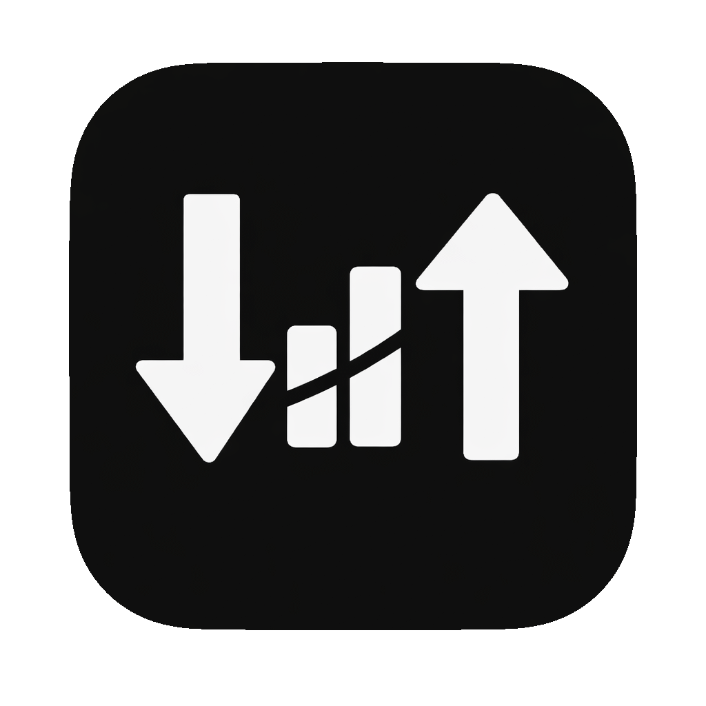

# MenubarNetSpeed

<p align="center">
  
</p>

macOS メニューバーに常駐し、Wi‑Fi (en0) など指定インターフェースの実効通信速度を 1 秒ごとに可視化する軽量ツールです。通常時は OS のネットワーク統計のみを参照し、ユーザー操作時にのみ外部通信を行います。

## 主な機能
- 上り/下り実効速度をメニューバーに常時表示
- メニューから最大速度測定（Cloudflare スピードテスト）
- 監視対象インターフェースをメニューで切替（en*/utun* 等を列挙）
- メニューから `sudo iftop -i <interface> -N -P -B -m 100M` を Terminal で起動（sudo パスワード入力が必要）
- Dock 非表示 (`LSUIElement`)

## 前提
- macOS 13 以降
- Xcode Command Line Tools（`swift` が使える環境）

## セットアップ
```bash
# ビルド & .app 生成（icon.png から appiconset/icns も自動生成）
make build

# /Applications へインストール
make install

# 実行（ビルド済み .app を open）
make run
```

生成物: `build/MenubarNetSpeed.app`

## クリーン
```bash
make clean
```

## ログ
- `/tmp/menubarnetspeed.log` にデバッグログを追記します。
- システムログの確認例:
  ```bash
  log show --style compact --predicate 'process == "MenubarNetSpeed"' --last 2m
  ```

## 開発メモ
- 計測インターフェース: `Sources/AppDelegate.swift` の `interfaceName` を変更。
- バンドル設定: `Info.plist` を編集（`CFBundleIdentifier` など）。
- アイコン: `assets/icon.png` を差し替えると、`make build` 時に自動で `AppIcon.iconset/.appiconset` と `AppIcon.icns` を再生成します。

## テスト
- 現状テストターゲットは未作成です。追加した場合は `make test`（`swift test`）で実行してください。

## ライセンス
このリポジトリのライセンス情報は未設定です。
